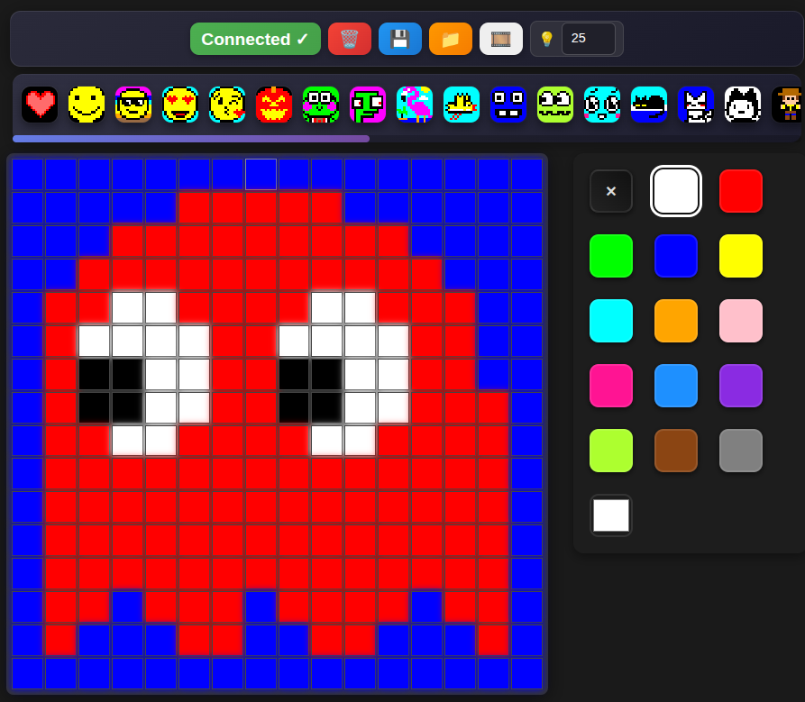

# pixelart-16x16

Paint pixels in your browser and watch them **instantly** light up on your 
physical LED matrix using **Bluetooth**.  

The project includes both the **firmware** for the ESP32-C3 and a **web app** for drawing, upload, and slideshow control.

<table>

<tr>
<td></td>
<td></td>
<td></td>
<td></td>
<td></td>
<td></td>
<td></td>
<td></td>
</tr>

<tr>
<td></td>
<td></td>
<td></td>
<td></td>
<td></td>
<td></td>
<td></td>
<td></td>
</tr>

<tr>
<td></td>
<td></td>
<td></td>
<td></td>
<td></td>
<td></td>
<td></td>
<td></td>
</tr>

<tr>
<td></td>
<td></td>
<td></td>
<td></td>
<td></td>
<td></td>
<td></td>
<td></td>
</tr>

<tr>
<td></td>
<td></td>
<td></td>
<td></td>
<td></td>
<td></td>
<td></td>
<td></td>
</tr>

<tr>
<td></td>
<td></td>
<td></td>
<td></td>
<td></td>
<td></td>
<td></td>
<td></td>
</tr>
</table>

## Hardware setup

- **ESP32-C3**:  Microcontroller (BLE + WiFi)
- **LED Matrix 16×16**: WS2812B (256 addressable RGB LEDs)
- **Power Supply**:  5 V DC, ≥ 3 A recommended
- **3D Printed Enclosure**: STL and FreeCAD files included in `/enclosure/`


**Pinout:**
| Signal | ESP32-C3 Pin | Notes |
|--------|--------------|-------|
| LED Data | GPIO 8 | Configurable via `DATA_PIN` |
| 5V | VIN | Power input |
| GND | GND | Common ground |

## Firmware (ESP32-C3 + WS2812B)

Firmware for controlling a 16×16 WS2812B LED matrix using an ESP32-C3 via **Bluetooth Low Energy (BLE)**.  
Designed to work with the **Web Control App**, which lets you draw and upload pixel art or animations wirelessly.

**Advertised Bluetooth device name:** `Matrix16x16`

## Web Control App

The Webapp uses the Web Bluetooth API to send data directly to your ESP32-C3.

Available at https://dmachard.github.io/pixelart-16x16/



This web interface lets you:
- Draw and color pixel art with instant LED feedback
- Control brightness  
- Save/load drawings as `.json` files  
- Play animated slideshows

Each drawing must be stored as a `.json` file in the `/drawings/` directory.  
Corresponding thumbnail images should be placed in the `/images/` directory.

You can generate a PNG thumbnail from any exported JSON drawing with the provided script:

```
cd web/
source venv/bin/activate
python scripts/json_to_png.py drawings/example.json
```
